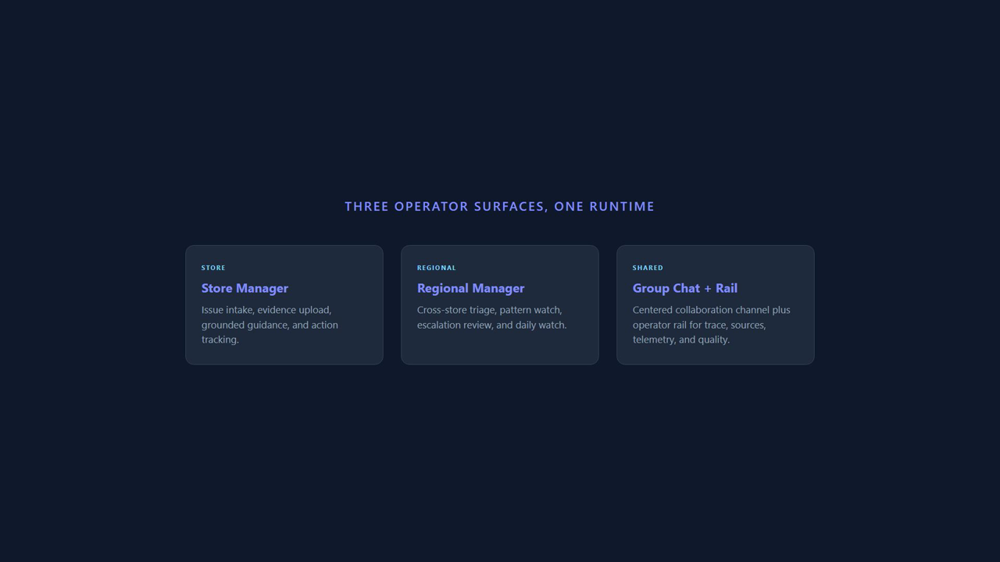
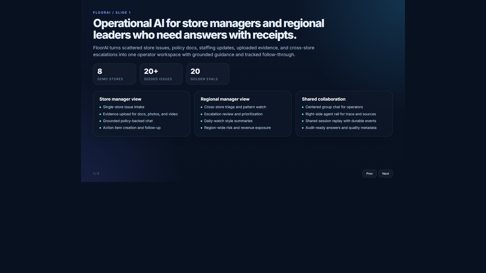
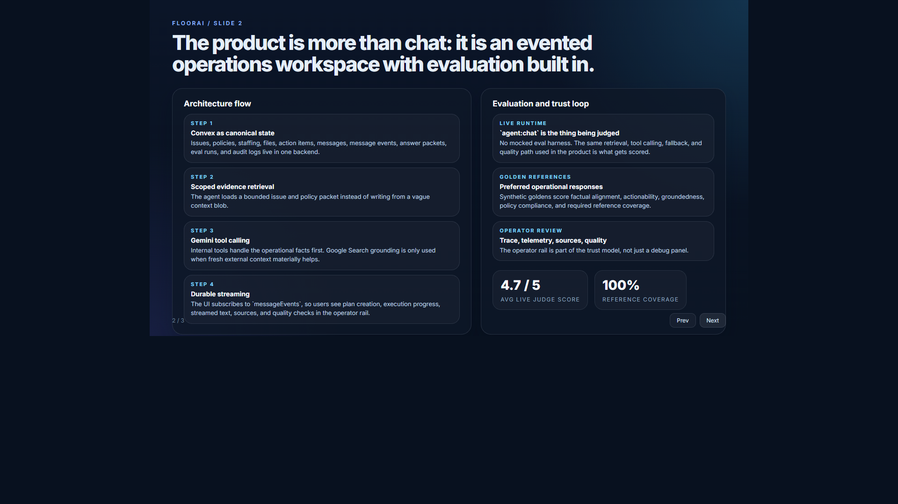
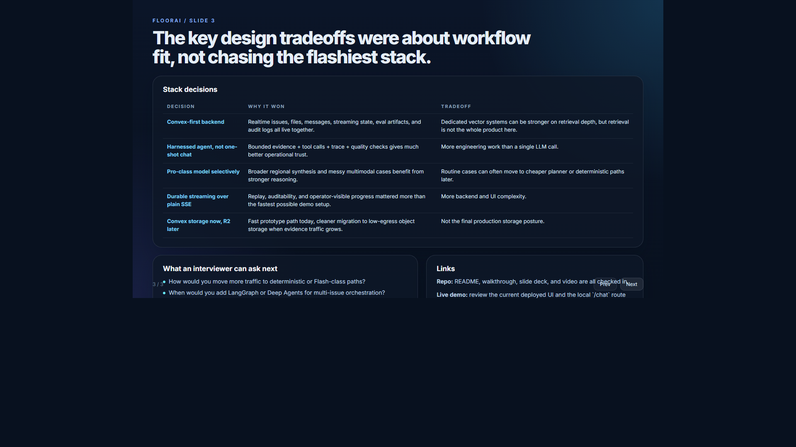

# FloorAI

Retail operations assistant for store managers and regional managers, built with Next.js, Convex, and Gemini.

This repo is the working prototype and interview artifact for a retail operations AI challenge. The core idea is simple: operators do not need a generic chatbot. They need a workspace that can read current issue state, company policy, uploaded evidence, cross-store context, and follow-up ownership, then return grounded guidance with traceability.

Related docs:
- [PLAN.md](PLAN.md)
- [INTERVIEW_WALKTHROUGH.md](INTERVIEW_WALKTHROUGH.md)

## What Shipped

- Store manager workspace for single-store issue intake, evidence upload, grounded chat, and action tracking
- Regional manager workspace for cross-store triage, escalation handling, risk scanning, and daily-watch style review
- Shared `/chat` surface with a centered group channel plus the expandable agent rail
- Gemini-powered assistant with internal Convex tools plus Google Search grounding when current external facts matter
- Durable streaming chat via `messageEvents`
- Answer packets, quality checks, trace metadata, and persisted eval runs
- Golden-dataset evaluation against live agent behavior

## Product At A Glance

```text
USER WORKSPACES
---------------
/                operator session picker
/store           single-store command view
/regional        cross-store regional command view
/chat            shared group chat

BACKEND
-------
Convex tables: issues, policies, inventory, staffing, files, messages,
messageEvents, actionItems, answerPackets, evalRuns, evalCases, eventLogs

AGENT
-----
Gemini 3.1 Pro Preview
  -> internal tool calls
  -> Google Search grounding
  -> streamed events
  -> answer packet + quality checks

EVALUATION
----------
golden_dataset.json
  -> live agent run
  -> judge scores + reference coverage
  -> persisted evalRuns / evalCases
```

## Demo Collateral

### Demo Video

[](https://github.com/HomenShum/floorai/raw/master/video/out/FloorAIDemo.mp4)

> Click the thumbnail to download and play the demo video (39s, 3 MB). Built with [Remotion](https://www.remotion.dev/) — source at [video/src](video/src). Run `npm run video:studio` to edit, `npm run video:render` to rebuild.

### Presentation Slides

**Slide 1 — Product overview and operator personas**



**Slide 2 — Architecture and evaluation pipeline**



**Slide 3 — Design tradeoffs and next steps**



> Interactive deck: [slides/presentation.html](slides/presentation.html)

### Asset index

| Asset | Path | What it is for |
| --- | --- | --- |
| Interview slide deck | [slides/presentation.html](slides/presentation.html) | Three-slide pitch deck for the live interview |
| Remotion source | [video/src](video/src) | Editable source for the narrated product demo |
| Rendered video | [video/out/FloorAIDemo.mp4](video/out/FloorAIDemo.mp4) | Shareable walkthrough video |

## Why This Design

This project was built around real retail operations workflows rather than a generic prompt-demo pattern.

The design targets two operator realities:

1. A store manager needs a fast, scoped answer about one store without being flooded by regional noise.
2. A regional manager needs multi-store synthesis, escalation context, and a way to spot patterns before they turn into repeated losses.

That drove the main product decisions:

- separate store and regional workspaces
- role-scoped access checks
- issue-linked evidence uploads
- action items as first-class records
- chat as an operator rail, not the whole UI
- evaluation against preferred operational responses, not just "the model said something plausible"

## Architecture

```text
NEXT.JS APP
  |
  |-- /store      store operations workspace
  |-- /regional   regional operations workspace
  |-- /chat       shared channel / group chat
  |
  v
CONVEX
  |
  |-- core data
  |     issues / policies / inventory / staffing / resolutions / files
  |
  |-- chat runtime
  |     messages / messageEvents / answerPackets
  |
  |-- quality runtime
  |     evalRuns / evalCases / eventLogs
  |
  v
AGENT RUNTIME
  |
  |-- [convex/briefs.ts](convex/briefs.ts)
  |     scoped evidence retrieval
  |
  |-- [convex/agent.ts](convex/agent.ts)
  |     planning, tool execution, synthesis, streaming, trace, quality
  |
  |-- Gemini 3.1 Pro Preview
  |     internal tool calling + googleSearch
  |
  v
OPERATOR RAIL
  |
  |-- streamed text deltas
  |-- plan summary
  |-- executed steps
  |-- telemetry
  |-- sources
  |-- quality checks
```

## Design Tradeoffs

This section is the "why" behind the stack, not just a list of what is in the repo today.

### 1. Canonical data plane vs vector-first stack

```text
WHAT THIS APP NEEDS MOST
------------------------
1. Realtime operational state
2. Scoped access control
3. File + issue + action-item locality
4. Reviewable agent traces and eval artifacts
5. Good-enough retrieval for policies and past resolutions

THAT PUSHES THE DECISION TOWARD
-------------------------------
canonical app backend first
vector engine second
```

| Option | What it is good at | What it costs | Fit for this app |
| --- | --- | --- | --- |
| `Convex` | Realtime app state, queries, mutations, actions, storage, scope enforcement, eval artifacts in one backend | Vector search is less retrieval-specialized than dedicated vector systems | Best prototype and product fit because the operational system of record mattered more than having the most advanced vector engine |
| `Postgres + pgvector` | Structured SQL joins plus vectors in one database, mature relational tooling | You still need realtime subscriptions, streaming state, storage coordination, and app wiring around it | Strong if the whole product standardizes on Postgres, but less attractive once the rest of the app already lives in Convex |
| `Chroma` | Fast local RAG iteration, lightweight document search, easy experimentation | Another moving part, weaker as the canonical operational backend | Good for retrieval experiments, not the best center of gravity for this product |
| `Pinecone` | Managed vector infrastructure, serverless scaling, strong retrieval focus | Separate control plane, extra cost center, metadata freshness and join complexity against the app database | Best when retrieval scale dominates the architecture; overkill for this prototype's workflow |
| `Qdrant` | Strong dense plus sparse search, advanced metadata filtering, flexible deployment | Another service to run and reason about, more retrieval engineering up front | The most attractive dedicated vector option here if retrieval becomes the bottleneck later |

Why the current repo stayed Convex-first:

- the app is fundamentally an operational workspace, not a retrieval product
- issue state, action items, files, audit logs, streamed message events, and eval artifacts all benefit from living in the same backend
- the retrieval corpus is important, but it is supporting evidence rather than the whole product

### 2. Deterministic vs single-call LLM vs harnessed agent

```text
2023-2024 COMMON PATTERN
------------------------
prompt everything to one strong model
  -> hidden reasoning
  -> react-style tool loop
  -> final answer

BETTER FIT FOR THIS APP
-----------------------
classify
  -> retrieve bounded evidence
  -> call tools explicitly
  -> synthesize only when needed
  -> validate references before finalizing
```

| Approach | Latency / cost | Strengths | Weaknesses | Best use here |
| --- | --- | --- | --- | --- |
| Deterministic renderer | Lowest | Fast, cheap, reliable, easy to audit | Brittle if the case is ambiguous or spans multiple issues | Tracked single-issue cases with known policy packet and known action steps |
| Single LLM call | Low to medium | Simple to ship, flexible, fewer moving parts | Easy to hallucinate, weak traceability, weak replayability, weak policy control | Good for early prototypes, not ideal for high-trust operations |
| Harnessed planner + tool calls | Medium | Explicit steps, inspectable trace, better grounding, easier quality gates | More engineering effort | Best current default for this app |
| Orchestrator-worker graph | Medium to high | Better multi-issue decomposition, parallel subwork, cleaner context management | More runtime complexity and stronger observability needs | Best next step for regional multi-issue synthesis |

Root-cause takeaway:

- single-issue quality improves when the assistant writes from a canonical issue packet, not a broad context blob
- multi-issue quality improves when retrieval and ranking are decomposed into typed steps before synthesis
- modern "agentic" quality comes less from hidden chain-of-thought and more from explicit intermediate state

### 3. Gemini 3.1 Pro Preview vs cheaper faster model paths

This repo is currently wired around `gemini-3.1-pro-preview`, but the workflow does not require that class of model for every turn.

```text
CHEAPEST PATH
-------------
deterministic render
  -> known issue
  -> known policy
  -> known action template

DEFAULT PATH
------------
flash / flash-lite style model
  -> classify
  -> plan tool order
  -> summarize tool results

EXPENSIVE PATH
--------------
pro-class model
  -> ambiguous cases
  -> broader regional synthesis
  -> web-grounded synthesis
  -> multimodal evidence review
```

| Path | Relative latency | Relative cost | What it is best at | Recommendation for this app |
| --- | --- | --- | --- | --- |
| Deterministic path | Lowest | Lowest | Exact known operational guidance | Use whenever the app already has a high-confidence issue + policy packet |
| Flash / Flash-Lite planner path | Lower | Lower | Classification, routing, extraction, planning tool order, concise summaries | This should handle a large share of day-to-day store and regional queries in production |
| Pro-class synthesis path | Higher | Higher | Ambiguity, nuanced synthesis, messy cross-issue prioritization, richer multimodal reasoning | Reserve for hard regional synthesis and cases where cheaper paths fail confidence checks |

Why this workflow probably did not need the strongest model for every request:

- many store questions are really retrieval plus policy application problems
- daily watch summaries are often aggregation and templating problems
- operator trust depends more on exact references than eloquence
- chained tool calls plus evidence packets can outperform a single expensive model turn on structured operational tasks

### 4. Where LangChain, LangGraph, Deep Agents, and Langfuse fit

| Layer | What it does | How it fits this repo |
| --- | --- | --- |
| `LangChain` | Model and tool abstraction layer | Useful if the team wants provider portability or shared tool interfaces across Python services |
| `LangGraph` | Graph runtime for orchestrator-worker flows, stateful multi-step agents | Strong candidate for the next-generation multi-issue synthesis runtime |
| `Deep Agents` | Higher-level planning, subagents, context management, streaming on top of LangGraph | A good fit for research-heavy or decomposition-heavy tasks, especially if regional synthesis becomes more complex |
| `Langfuse` | Observability, tracing, evaluation, prompt/version analytics | Best paired alongside the runtime, not instead of it; especially useful once production traffic, latency, and cost monitoring matter |

Current recommendation:

- keep the canonical app state, streaming state, answer packets, and eval artifacts in Convex
- introduce LangGraph or Deep Agents only when regional multi-issue orchestration clearly exceeds what the Convex-native harness should own
- add Langfuse when you want richer cross-environment tracing, prompt analytics, production eval sampling, and cost dashboards

### 5. Durable streaming vs plain SSE

```text
SSE ONLY
--------
request -> token stream -> browser
           no replay
           no durable audit trail

DURABLE STREAMING
-----------------
request -> draft message
        -> messageEvents
        -> live subscriptions
        -> replay / audit / eval
```

| Pattern | Strengths | Weaknesses | Fit here |
| --- | --- | --- | --- |
| Plain SSE | Fast to build, good for token streaming demos | Fragile reconnect story, ephemeral state, harder auditability, weaker replay | Fine for a simple chat demo |
| Durable Convex `messageEvents` | Survives reloads, supports replay, trace rendering, quality metadata, and auditability | More backend work | Best fit for an operator product where progress visibility and post-run inspection matter |
| Hybrid SSE + durable checkpoints | Best perceived latency plus durable milestones | Highest complexity | Worth considering later if token-by-token transport latency becomes a UX bottleneck |

### 6. File storage: Convex today, R2 vs S3 in production

| Option | Strengths | Weaknesses | Recommendation here |
| --- | --- | --- | --- |
| Convex file storage | Fastest prototype path, tightest integration with app data and queries | Not the cheapest long-term object storage for heavy evidence traffic | Right default for this prototype |
| Cloudflare R2 | S3-compatible API, no egress charge, attractive for evidence-heavy workloads | Smaller ecosystem than S3, still another storage plane to manage | Best production target if attachment read traffic becomes meaningful |
| Amazon S3 | Deepest ecosystem, mature IAM and lifecycle tooling, broad enterprise familiarity | Public internet data transfer out is billed and region-dependent; more config overhead | Best when an org is already all-in on AWS governance and tooling |

### 7. Final stack stance

```text
CURRENT BEST FIT
----------------
Convex as canonical app backend
  + Convex-native streaming + eval artifacts
  + Gemini tool calling
  + deterministic fast path
  + cheaper planner path for routine work
  + pro-class synthesis only for hard cases

NEXT EVOLUTION
--------------
Convex stays system of record
  + LangGraph / Deep Agents for hard multi-issue orchestration
  + Langfuse for production observability and eval monitoring
  + R2 for heavier attachment traffic
```

### 8. Production retrieval evolution: Convex first, GraphRAG second

One of the most useful interview takeaways was that "regional retail problems" are not uniform. A coastal store, a college-town store, and a suburban family-heavy store can all fail for different reasons even when the top-line issue label looks similar.

Examples:

- population mix can change staffing pressure, basket composition, and shrink patterns
- weather can change perishables risk, HVAC urgency, foot traffic, and safety incidents
- supply patterns can tie the same vendor or SKU failure across multiple stores even when the store managers describe the issue differently

That is exactly where a graph starts becoming attractive.

```text
PROTOTYPE SHAPE
---------------
Convex
  -> operational state
  -> files
  -> streaming events
  -> eval artifacts

PRODUCTION EVOLUTION
--------------------
Convex (system of record)
  -> curated closed tickets + policies + vendor + SKU facts
  -> projection pipeline
  -> Neo4j GraphRAG knowledge graph
  -> multi-hop retrieval for regional synthesis
```

Why a graph can help for broader multi-issue synthesis:

- it preserves relationships directly instead of forcing everything into flat text chunks
- it makes cross-store questions more natural:
  - `Store -> Region`
  - `Issue -> Policy`
  - `Issue -> SKU`
  - `Issue -> Vendor`
  - `Issue -> WeatherEvent`
  - `Issue -> PopulationSegment`
  - `Resolution -> Outcome`
- it supports retrieving context around the match, not just the matched chunk itself

The current Neo4j GraphRAG Python package is a serious production candidate for this layer:

- it is Neo4j's official first-party GraphRAG package
- it supports vector indexes and standard RAG retrievers
- it supports richer retrieval modes such as `VectorCypherRetriever`, `HybridRetriever`, and `Text2Cypher`
- it also supports external vector stores such as Pinecone and Qdrant while still using Neo4j as the relationship layer

That means the future path does not have to be "replace Convex with Neo4j." The better path is:

```text
Convex = operational truth
Neo4j  = historical relationship projection for richer retrieval
Langfuse = tracing / eval / drift monitoring
```

Recommended production shape:

| Layer | Recommendation | Why |
| --- | --- | --- |
| Canonical app backend | `Convex` | Keep the operational app state, files, sessions, actions, and eval artifacts in one place |
| Historical retrieval projection | `Neo4j` | Best fit once closed tickets, vendors, SKUs, stores, policies, and environmental factors need relationship-aware retrieval |
| Vector path | Start with Neo4j native vector indexes; keep Pinecone/Qdrant as optional external retrievers if scale or infra standards require them | Lets the graph own relationships while leaving room for a dedicated vector service later |
| Monitoring | `Langfuse` plus product metrics | Track trace quality, latency, eval drift, and new-topic emergence |

Important caution: the Neo4j Knowledge Graph Builder exists today, but its KG-construction features are still marked experimental. For production, that means favoring a reviewed ETL / upsert pipeline over fully automatic graph construction until the schema and entity extraction contract are stable.

## Agent Chat Design

The assistant is not treated as a single blocking `ask()` call. It is a product surface with durable execution state.

### What the rail does

- opens as an expandable operator sidebar instead of taking over the whole workspace
- supports store-scoped, regional-scoped, and shared-session chat
- renders streamed answer text instead of waiting for a final blob
- shows trace data in a readable operator format
- displays clickable sources for grounded runs
- exposes quality checks and answer packet metadata for reviewability

### Root-cause design decisions

#### 1. Durable streaming over blocking waits

The original weak pattern is:

```text
user submits prompt
  -> action runs
  -> UI waits
  -> final answer arrives all at once
```

That hides progress, makes tool execution opaque, and gives no durable intermediate state.

The shipped pattern is:

```text
user submits prompt
  -> assistant draft message created
  -> messageEvents appended during planning / execution / synthesis
  -> UI subscribes live to message + deltas
  -> final answer packet persisted
```

That is why the rail can now show:

- run started
- plan created
- tool step progress
- streamed answer text
- final quality checks

#### 2. Trace as product, not debug residue

The agent trace is stored and rendered intentionally. It includes:

- planner summary
- planned steps
- executed steps
- tool names
- arguments
- durations
- success state
- model-turn telemetry
- grounded sources

This matters for operator trust and interview storytelling. The assistant is inspectable.

#### 3. Sources must be readable

Google grounding returns redirect-style URLs. The UI cleans those into readable source cards and routes them through a source endpoint so the user gets a usable click target instead of a raw grounding redirect.

### Current chat surfaces

- [src/components/ChatPanel.tsx](src/components/ChatPanel.tsx)
- [src/components/GroupChat.tsx](src/components/GroupChat.tsx)
- [convex/messages.ts](convex/messages.ts)
- [convex/answerPackets.ts](convex/answerPackets.ts)
- [src/app/api/source/route.ts](src/app/api/source/route.ts)

## Evaluation Design

This repo treats evaluation as part of the product, not a side notebook.

### Canonical datasets

- [data/golden_dataset.json](data/golden_dataset.json)
- [data/synthetic_preferred_responses.json](data/synthetic_preferred_responses.json)

These are synthetic reference cases for prototype evaluation only.

### Live evaluation path

- [convex/eval.ts](convex/eval.ts)

The important part is that evaluation runs the live `agent:chat` path, not a separate mocked harness. That means the same retrieval, tool calling, synthesis, fallback, and quality logic used by the product is what gets judged.

### What gets scored

- factual alignment
- actionability
- completeness
- groundedness
- policy compliance
- required reference coverage

### Persisted quality artifacts

- `answerPackets`
- `evalRuns`
- `evalCases`
- message-level quality metadata

That gives the project durable answers to:

- What did the assistant say?
- What evidence and tools were used?
- Did it pass runtime quality checks?
- Did it pass the golden eval set?

### Production-grade golden dataset strategy

The prototype uses synthetic goldens, but the right production evolution is more strict:

```text
PREVIOUSLY CLOSED TICKETS
  -> cleanup + dedupe + policy revalidation
  -> high-quality goldens for judging

SEPARATELY
  -> retrieval projection / GraphRAG corpus
  -> historical context for the agent
```

This separation matters. The same historical ticket should not silently define both:

- what the model retrieves
- and what "success" means in evaluation

Recommended production workflow:

1. Start from previously closed issues with verified outcomes.
2. Remove stale policy guidance, contradictory resolutions, and low-quality operator writeups.
3. Promote only the highest-quality subset into a judged golden dataset.
4. Keep the broader cleaned historical set as retrieval material, not as the scoring truth.
5. Version the goldens and run eval gates before deployment.

### Monitoring new topics and graph maintenance

Once historical issue data becomes large enough, the maintainability question changes from "Can we retrieve?" to "Can we keep the retrieval layer current without rebuilding it all the time?"

Recommended pattern:

```text
new incidents + closures + policy changes
  -> monitoring / drift detection
  -> reviewed delta extraction
  -> incremental graph upserts
  -> refreshed GraphRAG retrieval
```

Concrete production recommendation:

- use trace and eval monitoring to detect new issue themes, policy drift, or repeated low-confidence answers
- create a review queue for genuinely new topics before adding them into the graph
- append reviewed deltas into Neo4j incrementally instead of doing full graph rebuilds
- keep goldens on a separate versioned path from retrieval updates

Neo4j CDC is a strong fit for the incremental-update side of that design because `db.cdc.query` can return changes after a known change identifier, which is exactly the shape you want for delta-based graph maintenance.

## Real User Scenarios Covered

### Store manager scenarios

- "We have a staffing no-show on Saturday. What can I approve right now?"
- "The cooler is failing. What policy applies and what is the next escalation?"
- "Milk is out again. Is this a tracked issue or a new one?"
- "I uploaded a photo and a PDF. Can you use them in the answer?"
- "Create a follow-up action item for this vendor issue."

### Regional manager scenarios

- "Which stores need intervention first?"
- "What patterns are emerging across the region?"
- "What should I do about the escalated HVAC cases?"
- "Give me a daily watch summary before I start triage."
- "Show me the stores with the highest revenue exposure."

### Shared/group scenarios

- multiple operators discussing the same issue thread
- regional and store leads reviewing the same context
- collaborative chat without losing sender attribution

## Interview Walkthrough Topics

If you are using this repo in an interview, these are the topics it is designed to support.

### Product framing

- why retail operations is a good AI workflow candidate
- why store and regional personas need different views
- why the product is more than "chat over data"

### Architecture framing

- why Convex was used as the operational backend
- why Gemini was chosen for tool calling plus web grounding
- why the chat rail is event-driven and traceable

### Quality framing

- why golden responses exist
- why live evaluation must run the same runtime as the product
- why answer packets and quality checks are persisted

### Tradeoff framing

- when to prefer deterministic answers
- when to allow broader synthesis
- what is prototype-grade vs what would need hardening in production

For the long-form walkthrough and ASCII appendix, see [INTERVIEW_WALKTHROUGH.md](INTERVIEW_WALKTHROUGH.md).

## Exact Claude Code Kickoff Prompt

The first prompt in the Claude Code JSONL transcript included an image attachment plus the following text. This block was extracted directly from the session transcript, with line wrapping normalized for README readability.

```text
DIRECTION: We are going with the Scenarios for Retail: Store Operations Assistant, spin up a prototype at the end, plan for now.

3:12PM, 1 hour 15 minutes, let's keep it short succinct and keep explanations suitable for technical as well as non-technical discussions. We will be going over these choices and tradeoffs as if we are going over them during the interview, make sure any responses are backed up by ideally at least one real URL link, so this way I can personally read and cross reference the material.

We will be making a slide show with a singular slide, up to three slides max (utilize https://github.com/zarazhangrui/frontend-slides) at the very end, going over the situation, task, answer, and result (essentially, let' say we picked Scenarios for Retail: Store Operations Assistant ; the slide show should help us acknowledge the issues faced by a typical store manager and a regional retail manager. Maybe we can think about Walmart/Trader Joes for this case assumption. We want to talk about the UIs we designed, one for the store manager (access to only their store) and another for the regional manager (access to all assigned stores). Something to prepare you ahead of time, we are likely going to use Convex for our database solution, the real time update can be quite useful for immediate responsive resolutions. We are likely going to use google gemini for the LLM Agent with tool calls to help us retrieve from the relational database on inventory side of things, vector database on historical resolutions, and NoSQL for any files (Google gemini actually has the ability for us to upload file directly to our google account, but in case if we were to need the files as individual contexts or to display the files, we should keep it stored on convex, maybe the S3 Bucket or cloudflare R2, give me your recommendations as well but make sure to explain why).

Below is the background context for What we will be working on today, I will give you the instructions and walk through for how we are going to approach this, while at the same time I would like you to help me generate synthetic dataset (ie CSV file of 20 test cases to help us see the lens of the problems and difficulties and issues and reports from Region Retail Managers and their associated individual store managers)

AI Prototype Challenge
You are an AI consultant helping a client solve a real business problem using AI. Your goal is to quickly
turn an unclear problem into a working solution.
Your Task:
- Build a simple AI prototype that shows how the solution would work
- Create one slide to explain and pitch your idea
- Walk through your prototype and explain your decisions in a live interview
Scenarios
Retail: Store Operations Assistant
A regional retail manager needs fast answers when issues arise across multiple store locations. The
solution takes a question or issue such as inventory gaps, staffing challenges, or operational blockers,
pulls relevant internal policies or historical data, and provides clear, actionable guidance.
Real Estate: Property Insight Generator
A commercial real estate broker wants a quick overview of a property before meeting a client. The
solution takes a property address or portfolio name, summarizes key property details, and highlights
risks or talking points relevant for client discussions.
Education: Course Planning Support Tool
A university department is designing or revising a course curriculum. The solution takes a course topic
or program name, suggests core modules and learning objectives, highlights emerging skills, and
identifies potential curriculum gaps.
Open Choice
Create your own AI use case in retail, real estate, education, or another industry of your choice.
Environment & Data
You have flexibility in how you build your solution. Choose the approach that best demonstrates your
capabilities. Data is not provided - you are responsible for sourcing or creating your own.
Deliverables
1. Working Prototype - Demonstrable via live demo; focus on core functionality over polish.
2. One Slide - Single slide to support your pitch to stakeholders.
3. Live Interview - Present your slide, demo your prototype, and answer questions.
```

## How The Prompt Evolved

The session transcript shows that the prompt started broad, then became more product-specific through feedback.

### Transcript-backed evolution

1. Kickoff prompt
   - architecture, tradeoffs, synthetic data, two personas, interview framing
2. UI simplification prompt
   - `i want new inspiration for even more modern compact minimal user mental model and experience, it shuold feel easy and familiar to use`
3. Workflow plus information-architecture prompt
   - `our LLM agent should also be used to provide daily watch or summaries`
   - `also how come i do not see the full redesign and rewrite to Linear sidebar + Slack-style threading`
4. Visual QA loop
   - screenshot-only critiques in the transcript
5. Layout correction prompt
   - `did you live verify, I thought the chat would be ni the center`

### What changed in intent over time

```text
START
  prototype + architecture + tradeoffs + synthetic data

THEN
  modern compact UX
  familiar mental model
  stronger information architecture

THEN
  daily watch / summaries
  Linear + Slack interaction model
  tighter live verification

SHIPPED RESULT
  guided store / regional workspaces
  operator rail chat
  streaming events
  traces and sources
  evaluation and quality persistence
```

### The hidden lesson

The initial prompt was strong on architecture, stack, and interview framing, but weak on:

- the exact UI mental model
- the desired chat interaction pattern
- how evaluation should be part of the product from day one
- the need for traceability, streaming, and quality artifacts

Those requirements arrived later through iteration instead of being front-loaded.

## Recommended Starting Prompt For Claude Code

If this project were starting from zero again, this is the prompt that should have been used up front.

```text
We are building a retail operations AI assistant for an interview demo and GitHub portfolio piece.

GOAL
- Deliver a working, shareable prototype plus a clean developer/interview README.
- Optimize for a truthful live walkthrough, not a fake polished mockup.

SCENARIO
- Use the Retail: Store Operations Assistant scenario.
- Two personas:
  1. Store manager: single-store issue intake, evidence upload, grounded support.
  2. Regional manager: multi-store triage, pattern detection, escalations, daily watch.

NON-NEGOTIABLE STACK
- Next.js App Router
- Convex for database, realtime subscriptions, storage, actions, and persisted evaluation artifacts
- Gemini 3.1 Pro Preview for tool calling and Google Search grounding
- Internal Convex tool surface for issues, policies, inventory, staffing, resolutions, files, and action items

PRODUCT REQUIREMENTS
- Build real store and regional workspaces, not just a chat demo.
- Keep the UI compact, familiar, and easy to parse.
- Use a Linear + Slack mental model:
  - clear left-side navigation / workspace structure
  - operational content in the main canvas
  - assistant in an expandable right rail
- Add a separate group-chat surface for shared collaboration.
- Make the chat issue-aware and role-aware.
- Include daily watch / summary support for regional usage.

AGENT REQUIREMENTS
- Internal data should be primary; use Google Search only when fresh external facts materially help.
- The assistant must cite exact issue IDs, policy IDs, SKUs, dates, thresholds, and action steps when available.
- Use deterministic evidence-bound behavior for straightforward single-issue cases where possible.
- Use model synthesis for broader multi-issue and regional prioritization questions.
- Persist plan, execution trace, sources, telemetry, quality checks, and answer packets.

STREAMING REQUIREMENTS
- Do not build chat as one blocking action that returns a final string.
- Implement durable event streaming with draft messages plus messageEvents.
- Stream text deltas, step progress, trace updates, and source cards into the UI.

EVALUATION REQUIREMENTS
- Create a synthetic dataset and a golden dataset.
- Evaluate the live agent runtime, not a mocked or separate harness.
- Persist eval runs and per-case results in Convex.
- Judge for:
  - factual alignment
  - policy grounding
  - actionability
  - completeness
  - groundedness
  - required reference coverage

REAL-WORLD WORKFLOW REQUIREMENTS
- Evidence upload for documents, photos, and videos
- Action item creation and completion
- Role and scope enforcement
- Audit logging
- Clear distinction between prototype auth/session simulation and real production auth

DOCUMENTATION REQUIREMENTS
- Update README as a new developer guide and interview guide.
- Include:
  - exact initial prompt
  - prompt evolution
  - architecture overview
  - agent chat design
  - evaluation design
  - real user scenarios
  - tradeoffs and production considerations
- Maintain a separate interview walkthrough markdown with ASCII diagrams.

WORKSTYLE
- Start with a spec and plan.
- Build vertically slice by slice.
- Verify in browser, not just in code.
- Fix root causes rather than layering patches.
- Cite current official docs when framework behavior matters.
```

## New Developer Guide

### Prerequisites

- Node.js 22+
- Python 3.11+
- a Convex deployment
- a Google Gemini API key

### Setup

1. Install dependencies.

   ```bash
   npm install
   ```

2. Set the Gemini key in Convex.

   ```bash
   npx convex env set GOOGLE_API_KEY your_key_here
   ```

3. Start local development.

   ```bash
   npm run dev
   ```

4. Seed the synthetic data.

   ```bash
   npm run seed
   ```

### Important scripts

```bash
npm run dev              # Convex + Next.js
npm run build            # Next.js production build
npm run seed             # Seed synthetic operational data
npm run eval:validate    # Validate the Python golden harness inputs
npm run eval:goldens     # Python golden eval
npm run eval:live        # Convex live eval against the agent runtime
npm run eval:live:local  # Local scripted live eval
npm run video:studio     # Open Remotion studio
npm run video:render     # Render video/out/FloorAIDemo.mp4
```

### Main files to know first

- [src/app/page.tsx](src/app/page.tsx)
- [src/app/store/page.tsx](src/app/store/page.tsx)
- [src/app/regional/page.tsx](src/app/regional/page.tsx)
- [src/app/chat/page.tsx](src/app/chat/page.tsx)
- [src/components/ChatPanel.tsx](src/components/ChatPanel.tsx)
- [src/components/GroupChat.tsx](src/components/GroupChat.tsx)
- [convex/schema.ts](convex/schema.ts)
- [convex/briefs.ts](convex/briefs.ts)
- [convex/agent.ts](convex/agent.ts)
- [convex/eval.ts](convex/eval.ts)

### What to preserve when extending the system

- Keep internal evidence primary for operational guidance.
- Do not let the model invent policy steps or issue references.
- Preserve streamed execution visibility in the operator rail.
- Treat evaluation as part of the runtime, not an afterthought.
- Keep README and walkthrough docs updated when the agent or evaluation contract changes.

## Repo Map

```text
src/app/                 app routes
src/components/          product UI surfaces
src/lib/                 shared frontend helpers
convex/                  schema, queries, mutations, actions, agent runtime
data/                    synthetic data + goldens
agents/                  Python evaluation harness
scripts/                 local verification / eval scripts
PLAN.md                  original architecture plan
INTERVIEW_WALKTHROUGH.md interview-ready deep walkthrough + ASCII appendix
README.md                GitHub overview + developer guide + prompt history
```

## Slide And Video Notes

### Slide deck

The old slide deck was replaced with a new three-slide deck in [slides/presentation.html](slides/presentation.html), using the linked `frontend-slides` repo as the reset point for tone and pacing.

It now matches the current product story:

- operator personas and workflows
- agent plus evaluation architecture
- key tradeoffs and stack decisions

### Remotion demo

The Remotion project lives under [video](video).

Key files:

- [video/src/Root.tsx](video/src/Root.tsx)
- [video/src/FloorAIDemo.tsx](video/src/FloorAIDemo.tsx)
- [video/src/scenes](video/src/scenes)

The rendered output is:

- [video/out/FloorAIDemo.mp4](video/out/FloorAIDemo.mp4)

This follows the Remotion Claude Code workflow documented here:

- https://www.remotion.dev/docs/ai/claude-code

## Production Notes

This is a production-style prototype, not a finished enterprise rollout.

The main next steps for a real deployment would be:

- replace demo operator sessions with real authentication and identity mapping
- harden canonical source resolution for grounded web citations
- expand typed worker and orchestrator flows for broader multi-issue synthesis
- use curated real historical resolutions only after cleanup and policy review
- project cleaned historical tickets into a secondary GraphRAG layer only after the relational model and entity schema are stable
- monitor new issue themes and append reviewed deltas into the graph instead of rebuilding it blindly
- add deployment gates based on eval regression thresholds

## Production Roadmap: GraphRAG, Curated Goldens, and Incremental Updates

This is the production evolution implied by the interview discussion, not the current prototype deployment.

```text
CONVEX
  -> operational truth
  -> files, issues, policies, action items
  -> streaming sessions and eval artifacts

CLEANED HISTORICAL CLOSED TICKETS
  -> curated goldens for judging
  -> separate retrieval projection

NEO4J
  -> relationship-aware historical graph
  -> vector indexes + GraphRAG retrievers

LANGFUSE
  -> traces
  -> evals
  -> drift / topic monitoring
```

### Why this matters

Different stores can surface different issue profiles because of:

- population mix
- weather patterns
- local vendor and supply-chain dependencies
- store format and traffic profile

That is why broader regional synthesis eventually benefits from a graph layer. A graph can make `store`, `vendor`, `policy`, `SKU`, `region`, `weather event`, and `resolution outcome` first-class connected entities instead of leaving those relationships buried inside text chunks.

### Recommended production shape

| Concern | Recommended home | Why |
| --- | --- | --- |
| Live operational state | `Convex` | Still the best home for current issues, files, action items, chat sessions, and eval artifacts |
| Historical relationship retrieval | `Neo4j` | Better fit once multi-hop relationships across stores, vendors, SKUs, policies, and environmental context matter |
| Vector retrieval | Neo4j vector indexes first, external retrievers second | The official Neo4j GraphRAG package supports Neo4j-native retrieval and can also work with external vector stores such as Pinecone and Qdrant |
| Monitoring and evals | `Langfuse` plus product metrics | Best fit for tracing, evaluation, latency/cost monitoring, and drift detection |

### Incremental graph maintenance

The maintainable production pattern is not "rebuild the graph every time." It is delta-based maintenance.

```text
new closed tickets / policy changes / vendor updates
  -> review + extraction
  -> incremental upserts
  -> refresh affected graph neighborhoods
  -> keep retrieval current without a full rebuild
```

Why this is practical:

- Neo4j CDC supports querying changes after a known change identifier via `db.cdc.query`
- Neo4j vector indexes are first-class and, as of Neo4j 2026.01, the preferred query path is the Cypher `SEARCH` clause
- the official Neo4j GraphRAG package already provides retrieval building blocks for vector, hybrid, and Cypher-backed retrieval

Important caution:

- the Neo4j Knowledge Graph Builder is available, but its KG-construction features are still experimental
- for production, prefer reviewed ETL and explicit upserts over fully automatic graph construction until the schema and extraction contract are stable

### Golden datasets in production

The correct production split is:

```text
cleaned high-quality closed tickets
  -> versioned golden dataset for judging

broader cleaned historical archive
  -> retrieval / GraphRAG corpus
```

That separation prevents a common failure mode where weak historical text becomes both:

- what the agent retrieves
- and what the evaluation system calls "correct"

### Monitoring new topics

Recommended operating loop:

```text
production traces + eval results + operator feedback
  -> detect new or drifting topics
  -> human review queue
  -> approved deltas appended into graph
  -> refreshed retrieval + updated goldens when warranted
```

This is the maintainable way to keep the system current as policies, vendors, weather patterns, and regional operating conditions change.

## Source Notes

These docs were used to ground the tradeoff and workflow sections.

- Convex vector search: https://docs.convex.dev/search/vector-search
- Convex file storage: https://docs.convex.dev/file-storage
- Gemini models: https://ai.google.dev/gemini-api/docs/models/gemini
- Gemini function calling: https://ai.google.dev/gemini-api/docs/function-calling
- LangGraph workflows and agents: https://docs.langchain.com/oss/python/langgraph/workflows-agents
- Deep Agents overview: https://docs.langchain.com/oss/python/deepagents/index
- Deep Agents streaming: https://docs.langchain.com/oss/python/deepagents/streaming
- Deep Agents frontend streaming patterns: https://docs.langchain.com/oss/python/deepagents/frontend/overview
- Langfuse overview: https://langfuse.com/docs
- Langfuse observability: https://langfuse.com/docs/observability/overview
- Langfuse LangChain integration: https://langfuse.com/docs/integrations/langchain
- Neo4j GraphRAG for Python: https://neo4j.com/docs/neo4j-graphrag-python/current/
- Neo4j GraphRAG RAG retrievers: https://neo4j.com/docs/neo4j-graphrag-python/current/user_guide_rag.html
- Neo4j Knowledge Graph Builder: https://neo4j.com/docs/neo4j-graphrag-python/current/user_guide_kg_builder.html
- Neo4j Change Data Capture: https://neo4j.com/docs/cdc/current/procedures/
- Neo4j vector indexes: https://neo4j.com/docs/cypher-manual/current/indexes/semantic-indexes/vector-indexes/
- pgvector: https://github.com/pgvector/pgvector
- Pinecone docs: https://docs.pinecone.io/
- Chroma embedding functions: https://docs.trychroma.com/docs/embeddings/embedding-functions
- Chroma index reference: https://docs.trychroma.com/cloud/schema/index-reference
- Qdrant overview: https://qdrant.tech/documentation/overview/what-is-qdrant/
- Qdrant search: https://qdrant.tech/documentation/search/
- Cloudflare R2 pricing: https://developers.cloudflare.com/r2/pricing/
- Amazon S3 pricing: https://aws.amazon.com/s3/pricing/

## License

Internal interview prototype unless otherwise noted.